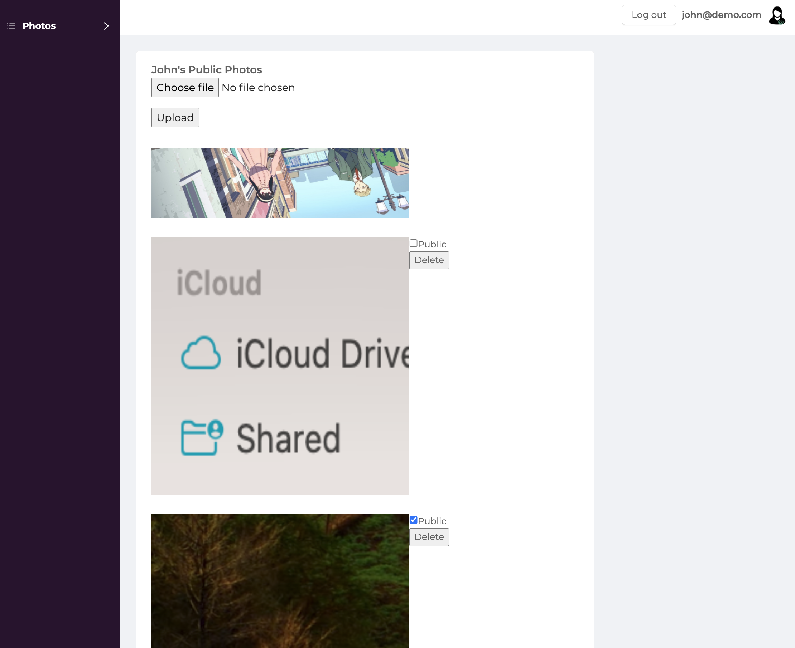
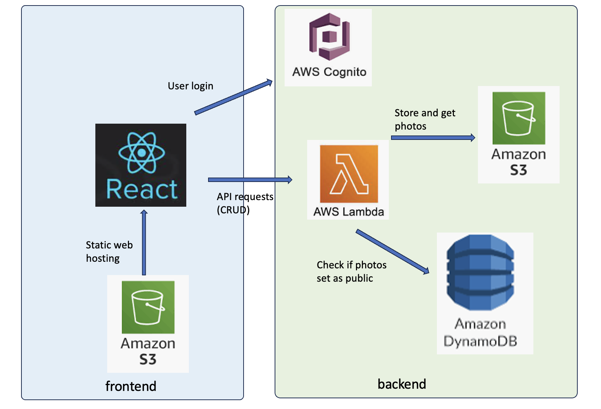

# PhotoLibrary - Developer Guide


### Architecture


### Technology Stack
a. Front end – React Framework hosted as static website in S3

b. Authentication – Amazon Cognito

c. Backend – Serverless framework, node.js in Amazon lambda, (cloudformation templates will be generated upon deployment)

d. DB – Dynamo DB

e. Storage – Amazon S3

## Demo
[Demo url](http://photolibrary-dhx.s3-website-ap-southeast-1.amazonaws.com/Photo) :
`http://photolibrary-dhx.s3-website-ap-southeast-1.amazonaws.com/Photo`

John (Admin) 
`john@demo.com`, password: `happy2021`

John's Friend
`johns_friend@demo.com`, password: `happy2021`

## Setup
### Prerequisite
You will need to set up your AWS-CLI and necessary permissions on S3, Cognito, Lambda, DynamoDB in order to deploy the component successfully. `aws configure`

Navigate to `/backend`, install the required dependencies:
``` sh
npm install
```
### Configurations
You will need to enter all configs in `./backend/serverless.yml` which includes:
> `AWS__REGION`: aws region <br>
> `S3__BUCKET__NAME`: S3 bucket name for storing the photos<br>
> `S3__BUCKET__NAME_STATIC_WEBSITE`: S3 bucket name for hosting static frontend<br>
> `DYNAMO_TABLE_NAME`: name of dynamoDB table name<br>

Once all configs are updated, run
```
sls deploy
```
Upon successful deployment, you will see a list of API endpoints. A folder `./serverless` is created, inside which there are cloudformation templates(which will be similar to the ones in `generated cloudformation templates`).

Take down the URLs and update these constant in `frontend/src/api/connections.ts`:
1. `BACKEND`
2. `S3_URL`

Run `npm install` again in `./frontend`, then you can start the development server by running or `npm run dev` or `yarn dev`.

### Deploy static website to S3 bucket:
A sciprt `./frontend/S3_deploy.sh` was created to assist deploying frontend to S3 to be hosted as static website. (You can explore this file to find out the steps involved.)
```sh
./S3_deploy.sh 
    --bucket photolibrary-dhx 
    [--skip-build] # if you wish to skip rebuilding of frontend
    [--undo] # if you want to delete S3 bucket, which allows for clean redeploy
```

## User Management
New user can be created in the AWS Cognito console. Password will need to be updated again as there is "Force password change" required.
``` sh
aws cognito-idp admin-set-user-password --user-pool-id YOUR_USER_POOL_ID --username USER_USERNAME --password NEW_PASSWORD --permanent
```


